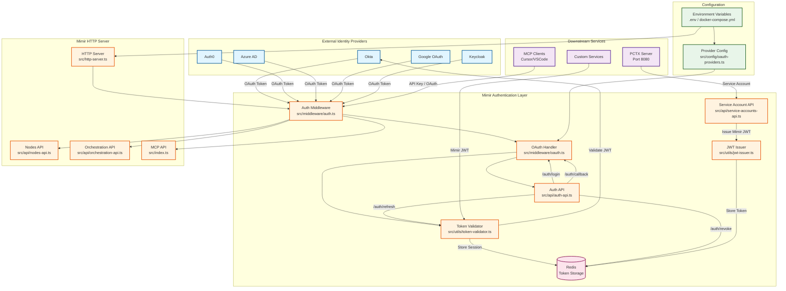

# Authentication Touchpoints - Implementation Reference

**Version**: 1.0.0  
**Date**: 2025-11-21  
**Purpose**: Quick reference for implementing authentication across Mimir

---

## 🎯 Authentication Flow Diagram



---

## 📋 Implementation Touchpoints

### Files to Create

| File | Purpose | Priority |
|------|---------|----------|
| `src/middleware/auth.ts` | Main authentication middleware (checks API keys, OAuth tokens) | **HIGH** |
| `src/middleware/oauth.ts` | OAuth 2.0 / OIDC flow implementation (authorization code, callback) | **HIGH** |
| `src/utils/token-validator.ts` | JWT validation against IdP JWKS | **HIGH** |
| `src/api/auth-api.ts` | Auth endpoints (`/auth/login`, `/auth/callback`, `/auth/refresh`) | **HIGH** |
| `src/api/api-keys-api.ts` | API key management (create, list, revoke) | **MEDIUM** |
| `src/config/oauth-providers.ts` | Provider configurations (Okta, Auth0, Azure, Google, Keycloak) | **HIGH** |

**Simplified**: Removed JWT issuer, service accounts, provider abstraction layers. Direct OAuth validation only.

### Files to Modify

| File | Changes Required | Impact |
|------|------------------|--------|
| `src/http-server.ts` | Add `authMiddleware` to all routes (except `/health`) | **HIGH** |
| `src/api/nodes-api.ts` | Extract user context from `req.user` (set by auth middleware) | **MEDIUM** |
| `src/api/orchestration-api.ts` | Extract user context from `req.user` | **MEDIUM** |
| `src/index.ts` (MCP) | Add authentication check for MCP tools | **MEDIUM** |
| `docker-compose.yml` | Add Redis service for token storage | **HIGH** |
| `.env` / `env.example` | Add all OAuth environment variables | **HIGH** |
| `package.json` | Add dependencies: `jsonwebtoken`, `jwks-rsa`, `express-session`, `connect-redis` | **HIGH** |

---

## 🔄 Authentication Flow by Use Case

### Use Case 1: User Logs In (OAuth)

```
1. User → Mimir: GET /auth/login
2. Mimir → IdP: 302 Redirect to IdP login page
3. User → IdP: Authenticate (username/password/MFA)
4. IdP → Mimir: 302 Redirect to /auth/callback?code=xxx&state=yyy
5. Mimir → IdP: POST /token (exchange code for tokens)
6. IdP → Mimir: {access_token, refresh_token, id_token}
7. Mimir → Redis: Store tokens
8. Mimir → User: Set session cookie + return Mimir JWT
```

**Files Involved**:
- `src/api/auth-api.ts` (endpoints)
- `src/middleware/oauth.ts` (OAuth flow)
- `src/utils/token-validator.ts` (validate tokens)
- `src/config/oauth-providers.ts` (provider config)

### Use Case 2: User Accesses Protected API

```
1. User → Mimir: GET /api/nodes/query (with session cookie)
2. Mimir (auth middleware): Extract session from cookie
3. Mimir (auth middleware): Load tokens from Redis
4. Mimir (auth middleware): Validate token expiration
5. Mimir (auth middleware): Set req.user = {id, email, roles}
6. Mimir (nodes-api): Process request with user context
7. Mimir → User: Return response
```

**Files Involved**:
- `src/middleware/auth.ts` (authentication check)
- `src/http-server.ts` (apply middleware)
- `src/api/nodes-api.ts` (use `req.user`)

### Use Case 3: PCTX Authenticates with API Key (Simplified)

```
1. PCTX → Mimir: GET /mcp (with X-API-Key: your-api-key)
2. Mimir (auth middleware): Validate API key against stored keys
3. Mimir (auth middleware): Set req.user = {service: 'pctx'}
4. Mimir → PCTX: Return MCP tools
```

**Files Involved**:
- `src/middleware/auth.ts` (validate API key)

**Simplified**: No token issuance, no JWT creation, no service accounts. Just API key validation.

### Use Case 4: Token Refresh

```
1. User → Mimir: GET /api/nodes/query (with expired access token)
2. Mimir (auth middleware): Detect token expiration
3. Mimir → User: 401 Unauthorized {error: "token_expired"}
4. User → Mimir: POST /auth/refresh (with refresh token)
5. Mimir → IdP: POST /token (refresh_token grant)
6. IdP → Mimir: {access_token, refresh_token (new)}
7. Mimir → Redis: Update stored tokens
8. Mimir → User: {access_token, expires_in}
9. User → Mimir: Retry original request with new token
```

**Files Involved**:
- `src/api/auth-api.ts` (`/auth/refresh` endpoint)
- `src/middleware/oauth.ts` (token refresh logic)
- `src/utils/token-validator.ts` (validate refresh token)

---

## 🔧 Configuration Touchpoints

### Environment Variables (35 new variables)

**Location**: `.env`, `env.example`, `docker-compose.yml`

| Category | Count | Examples |
|----------|-------|----------|
| **Feature Flags** | 2 | `MIMIR_ENABLE_SECURITY`, `MIMIR_DEFAULT_AUTH_METHOD` |
| **OAuth Provider** | 8 | `MIMIR_AUTH_PROVIDER`, `MIMIR_OAUTH_ISSUER`, `MIMIR_OAUTH_CLIENT_ID` |
| **Token Management** | 10 | `MIMIR_JWT_SECRET`, `MIMIR_ACCESS_TOKEN_LIFETIME`, `MIMIR_TOKEN_STORAGE` |
| **Session Management** | 7 | `MIMIR_SESSION_SECRET`, `MIMIR_SESSION_TIMEOUT`, `MIMIR_SESSION_COOKIE_SECURE` |
| **Service Accounts** | 5 | `MIMIR_ENABLE_SERVICE_ACCOUNTS`, `MIMIR_SERVICE_ACCOUNT_TOKEN_LIFETIME` |
| **Security Features** | 3 | `MIMIR_OAUTH_ENABLE_PKCE`, `MIMIR_OAUTH_ENABLE_STATE` |

**See**: [Security Environment Variables](./SECURITY_ENVIRONMENT_VARIABLES.md)

### Docker Compose Changes

**Add Redis Service**:
```yaml
services:
  redis:
    image: redis:7-alpine
    ports:
      - "6379:6379"
    volumes:
      - redis_data:/data
    command: redis-server --appendonly yes

volumes:
  redis_data:
```

**Update Mimir Service**:
```yaml
services:
  mimir_server:
    environment:
      # Add all 35 OAuth environment variables
      - MIMIR_ENABLE_SECURITY=${MIMIR_ENABLE_SECURITY:-false}
      - MIMIR_AUTH_METHODS=${MIMIR_AUTH_METHODS:-api-key}
      # ... (see SECURITY_ENVIRONMENT_VARIABLES.md)
    depends_on:
      - neo4j
      - redis  # NEW
```

### Package Dependencies

**Add to `package.json`**:
```json
{
  "dependencies": {
    "jsonwebtoken": "^9.0.2",
    "jwks-rsa": "^3.1.0",
    "express-session": "^1.18.0",
    "connect-redis": "^7.1.0",
    "redis": "^4.6.0",
    "passport": "^0.7.0",
    "passport-oauth2": "^1.8.0"
  }
}
```

---

## 🎯 Implementation Checklist

### Week 1: Basic OAuth (One Provider)

- [ ] Create `src/middleware/auth.ts` (API key + OAuth validation)
- [ ] Create `src/middleware/oauth.ts` (authorization code flow)
- [ ] Create `src/utils/token-validator.ts` (JWT validation)
- [ ] Create `src/api/auth-api.ts` (`/auth/login`, `/auth/callback`, `/auth/refresh`)
- [ ] Create `src/config/oauth-providers.ts` (Okta config)
- [ ] Modify `src/http-server.ts` (apply auth middleware)
- [ ] Add Redis to `docker-compose.yml`
- [ ] Add OAuth env vars to `.env` and `env.example`
- [ ] Test OAuth login with Okta

### Week 2: Multi-Provider Support

- [ ] Create `src/providers/base-provider.ts` (abstract class)
- [ ] Create `src/providers/okta.ts`
- [ ] Create `src/providers/auth0.ts`
- [ ] Create `src/providers/azure.ts`
- [ ] Create `src/providers/google.ts`
- [ ] Create `src/providers/keycloak.ts`
- [ ] Update `src/config/oauth-providers.ts` (provider factory)
- [ ] Test all providers

### Week 3: API Key Management

- [ ] Create `src/api/api-keys-api.ts` (create, list, revoke API keys)
- [ ] Modify `src/middleware/auth.ts` (add API key validation)
- [ ] Test PCTX authentication with API key

### Week 4: Token Management

- [ ] Create `src/api/token-api.ts` (token introspection, revocation)
- [ ] Create `src/jobs/token-cleanup.ts` (cleanup expired tokens)
- [ ] Create `src/utils/token-monitor.ts` (monitoring)
- [ ] Add token refresh logic to `src/api/auth-api.ts`
- [ ] Add metrics endpoints
- [ ] Production testing

---

## 📊 Quick Reference Table

| Component | Location | Incoming | Outgoing | Purpose |
|-----------|----------|----------|----------|---------|
| **Auth Middleware** | `src/middleware/auth.ts` | HTTP requests | `req.user` object | Validate API keys or OAuth tokens |
| **OAuth Handler** | `src/middleware/oauth.ts` | OAuth callbacks | Tokens to Redis | Handle OAuth 2.0 flow |
| **Token Validator** | `src/utils/token-validator.ts` | OAuth JWT tokens | Validation result | Validate JWT signatures against IdP JWKS |
| **Auth API** | `src/api/auth-api.ts` | `/auth/*` requests | Tokens, redirects | OAuth endpoints (login, callback, refresh) |
| **API Keys API** | `src/api/api-keys-api.ts` | API key requests | API keys | Create, list, revoke API keys |
| **Redis** | Docker service | Token storage requests | Stored tokens | Persist OAuth tokens, sessions |
| **HTTP Server** | `src/http-server.ts` | All HTTP requests | Protected responses | Apply auth middleware to routes |
| **PCTX** | External (port 8080) | API Key | MCP requests | Downstream service authentication |

**Simplified**: Removed JWT issuer, service account API. Direct OAuth validation + simple API keys.

---

## 🔒 Security Checkpoints

### Checkpoint 1: Request Entry
- **Location**: `src/http-server.ts`
- **Check**: Is `MIMIR_ENABLE_SECURITY=true`?
- **Action**: Apply `authMiddleware` to all routes except `/health`

### Checkpoint 2: Token Validation
- **Location**: `src/middleware/auth.ts`
- **Check**: Valid API key, OAuth token, or Mimir JWT?
- **Action**: Set `req.user` or return 401 Unauthorized

### Checkpoint 3: Token Expiration
- **Location**: `src/utils/token-validator.ts`
- **Check**: Token expired?
- **Action**: Return 401 with `token_expired` error

### Checkpoint 4: User Context
- **Location**: `src/api/nodes-api.ts`, `src/api/orchestration-api.ts`
- **Check**: `req.user` exists?
- **Action**: Use user context for audit logging, RBAC

### Checkpoint 5: Service Account Permissions
- **Location**: `src/middleware/auth.ts`
- **Check**: Service account has required permissions?
- **Action**: Allow or deny based on permissions

---

**Document Version**: 1.0.0  
**Last Updated**: 2025-11-21  
**Maintainer**: Security Team  
**Status**: Implementation Reference
