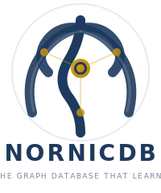

<p align="center">
  
</p>

<h1 align="center">NornicDB</h1>

<p align="center">
  <strong>The Graph Database That Learns</strong><br/>
  Neo4j-compatible • GPU-accelerated • Memory that evolves
</p>

<p align="center">
  <a href="#quick-start">Quick Start</a> •
  <a href="#features">Features</a> •
  <a href="#docker-images">Docker</a> •
  <a href="#documentation">Docs</a>
</p>

---

## What is NornicDB?

NornicDB is a high-performance graph database designed for AI agents and knowledge systems. It speaks Neo4j's language (Bolt protocol + Cypher) so you can switch with zero code changes, while adding intelligent features that traditional databases lack.

NornicDB automatically discovers and manages relationships in your data, weaving connections that let meaning emerge from your knowledge graph.

## Quick Start

### Docker (Recommended)

```bash
# Ready to go - includes embedding model
docker run -d --name nornicdb \
  -p 7474:7474 -p 7687:7687 \
  -v nornicdb-data:/data \
  timothyswt/nornicdb-arm64-metal-bge:latest  # Apple Silicon
  # timothyswt/nornicdb-amd64-cuda-bge:latest  # NVIDIA GPU
```

### From Source

```bash
git clone https://github.com/orneryd/mimir.git
cd mimir/nornicdb
go build -o nornicdb ./cmd/nornicdb
./nornicdb serve
```

### Connect

Use any Neo4j driver — Python, JavaScript, Go, Java, .NET:

```python
from neo4j import GraphDatabase

driver = GraphDatabase.driver("bolt://localhost:7687")
with driver.session() as session:
    session.run("CREATE (n:Memory {content: 'Hello NornicDB'})")
```

## Features

### 🔌 Neo4j Compatible

Drop-in replacement for Neo4j. Your existing code works unchanged.

- **Bolt Protocol** — Use official Neo4j drivers
- **Cypher Queries** — Full query language support  
- **Schema Management** — Constraints, indexes, vector indexes

### 🧠 Intelligent Memory

Memory that behaves like human cognition.

| Memory Tier | Half-Life | Use Case |
|-------------|-----------|----------|
| **Episodic** | 7 days | Chat context, sessions |
| **Semantic** | 69 days | Facts, decisions |
| **Procedural** | 693 days | Skills, patterns |

```cypher
// Find memories that are still strong
MATCH (m:Memory) WHERE m.decayScore > 0.5
RETURN m.title ORDER BY m.decayScore DESC
```

### 🔗 Auto-Relationships

NornicDB weaves connections automatically:

- **Embedding Similarity** — Related concepts link together
- **Co-access Patterns** — Frequently queried pairs connect
- **Temporal Proximity** — Same-session nodes associate
- **Transitive Inference** — A→B + B→C suggests A→C

### ⚡ Performance

**LDBC Social Network Benchmark** (M3 Max, 64GB):

| Query Type | NornicDB | Neo4j | Speedup |
|------------|----------|-------|---------|
| **Message content lookup** | 6,389 ops/sec | 518 ops/sec | **12x** |
| **Recent messages (friends)** | 2,769 ops/sec | 108 ops/sec | **25x** |
| **Avg friends per city** | 4,713 ops/sec | 91 ops/sec | **52x** |
| **Tag co-occurrence** | 2,076 ops/sec | 65 ops/sec | **32x** |

**Northwind Benchmark** (M3 Max vs Neo4j, same hardware):

| Operation | NornicDB | Neo4j | Speedup |
|-----------|----------|-------|---------|
| **Index lookup** | 7,623 ops/sec | 2,143 ops/sec | **3.6x** |
| **Count nodes** | 5,253 ops/sec | 798 ops/sec | **6.6x** |
| **Write: node** | 5,578 ops/sec | 1,690 ops/sec | **3.3x** |
| **Write: edge** | 6,626 ops/sec | 1,611 ops/sec | **4.1x** |

**Cross-Platform (CUDA on Windows i9-9900KF + RTX 2080 Ti):**

| Operation | Throughput |
|-----------|------------|
| **Orders by customer** | 4,252 ops/sec |
| **Products out of stock** | 4,174 ops/sec |
| **Find category** | 4,071 ops/sec |

**Additional advantages:**
- **Memory footprint**: 100-500 MB vs 1-4 GB for Neo4j
- **Cold start**: <1s vs 10-30s for Neo4j

> See [full benchmark results](docs/BENCHMARK_RESULTS_VS_NEO4J.md) for detailed comparisons.

### 🎯 Vector Search

Native semantic search with GPU acceleration.

```cypher
// Find similar memories
CALL db.index.vector.queryNodes(
  'memory_embeddings', 
  10, 
  $queryVector
) YIELD node, score
RETURN node.content, score
```

## Docker Images

| Image | Platform | Size | Model |
|-------|----------|------|-------|
| `nornicdb-arm64-metal` | Apple Silicon | ~50MB | BYOM |
| `nornicdb-arm64-metal-bge` | Apple Silicon | ~1.6GB | Included |
| `nornicdb-amd64-cuda` | NVIDIA GPU | ~3GB | BYOM |
| `nornicdb-amd64-cuda-bge` | NVIDIA GPU | ~4.5GB | Included |

**BYOM** = Bring Your Own Model (mount at `/app/models`)

```bash
# With your own model
docker run -d -p 7474:7474 -p 7687:7687 \
  -v /path/to/models:/app/models \
  timothyswt/nornicdb-arm64-metal:latest
```

## Configuration

```yaml
# nornicdb.yaml
server:
  bolt_port: 7687
  http_port: 7474
  data_dir: ./data

embeddings:
  provider: local  # or ollama, openai
  model: bge-m3
  dimensions: 1024

decay:
  enabled: true
  recalculate_interval: 1h

auto_links:
  enabled: true
  similarity_threshold: 0.82
```

## Use Cases

- **AI Agent Memory** — Persistent, queryable memory for LLM agents
- **Knowledge Graphs** — Auto-organizing knowledge bases
- **RAG Systems** — Vector + graph retrieval in one database
- **Session Context** — Decaying conversation history
- **Research Tools** — Connect papers, notes, and insights

## Documentation

| Guide | Description |
|-------|-------------|
| [Functions Reference](docs/FUNCTIONS_INDEX.md) | All 52 Cypher functions |
| [Memory Decay](docs/functions/07_DECAY_SYSTEM.md) | Cognitive memory system |
| [Docker Guide](docker/README.md) | Build & deployment |
| [Complete Examples](docs/COMPLETE_EXAMPLES.md) | Real-world patterns |

## Comparison

| Feature | Neo4j | NornicDB |
|---------|-------|----------|
| Protocol | Bolt ✓ | Bolt ✓ |
| Query Language | Cypher ✓ | Cypher ✓ |
| Memory Decay | Manual | Automatic |
| Auto-Relationships | No | Built-in |
| Vector Search | Plugin | Native |
| GPU Acceleration | No | Metal/CUDA |
| Embedded Mode | No | Yes |
| License | GPL | MIT |

## Building

```bash
# Native binary
make build

# Docker images
make build-arm64-metal      # Base (BYOM)
make build-arm64-metal-bge  # With model
make build-amd64-cuda       # NVIDIA base
make build-amd64-cuda-bge   # NVIDIA with model

# Deploy to registry
make deploy-all             # Both variants for your arch
```

## Roadmap

- [x] Neo4j Bolt protocol
- [x] Cypher query engine (52 functions)
- [x] Memory decay system
- [x] GPU acceleration (Metal, CUDA)
- [x] Vector & full-text search
- [ ] Auto-relationship engine
- [ ] HNSW vector index
- [ ] Clustering support

## License

MIT License — Part of the [Mimir](https://github.com/orneryd/mimir) project.

---

<p align="center">
  <em>Weaving your data's destiny</em>
</p>
