# NornicDB Architecture

**Version:** 0.1.4  
**Last Updated:** December 1, 2025

## Overview

NornicDB is a **drop-in replacement for Neo4j** designed for LLM agent memory systems. It maintains full compatibility with Mimir's existing API while providing:

- **MCP Server** - Native LLM tool integration (6 tools)
- **Auto-Embedding** - Server-side embedding for vector queries
- **GPU Acceleration** - 10-100x speedup (Metal/CUDA/OpenCL/Vulkan)
- **Hybrid Search** - RRF fusion of vector + BM25

## System Architecture Diagram

```mermaid
%%{init: {'theme':'dark', 'themeVariables': { 'darkMode': true }}}%%
graph TB
    subgraph Client["🌐 Client Layer"]
        Neo4jDriver["Neo4j Driver<br/>(JavaScript/Python/Go)"]
        HTTPClient["HTTP/REST Client"]
        MCPClient["MCP Client<br/>(Cursor, Claude, etc.)"]
    end

    subgraph Security["🔒 Security Layer"]
        TLS["TLS 1.3 Encryption"]
        Auth["Authentication<br/>• Basic Auth<br/>• JWT tokens<br/>• RBAC (Admin/ReadWrite/ReadOnly)"]
    end

    subgraph Protocol["📡 Protocol Layer"]
        BoltServer["Bolt Protocol<br/>:7687"]
        HTTPServer["HTTP/REST<br/>:7474"]
        MCPServer["MCP JSON-RPC<br/>/mcp endpoint<br/>• store/recall/discover<br/>• link/task/tasks"]
    end

    subgraph Embedding["🧠 Embedding Layer"]
        EmbedQueue["Embed Worker<br/>• Pull-based processing<br/>• Chunking (512/50 overlap)<br/>• Retry with backoff"]
        EmbedCache["Embedding Cache<br/>• LRU (10K default)<br/>• 450,000x speedup"]
        EmbedService["Embedding Service<br/>• Ollama/OpenAI/Local GGUF<br/>• String query auto-embed"]
    end

    subgraph Processing["⚙️ Query Processing (CPU)"]
        CypherParser["Cypher Parser<br/>• Multi-line SET with arrays<br/>• Parameter substitution"]
        QueryExecutor["Query Executor<br/>• MATCH/CREATE/MERGE<br/>• Vector procedures<br/>• String auto-embedding"]
        TxManager["Transaction Manager<br/>• WAL durability<br/>• ACID guarantees"]
    end

    subgraph Storage["💾 Storage Layer"]
        BadgerDB["BadgerDB Engine<br/>• Streaming iteration<br/>• LSM-tree storage"]
        Schema["Schema Manager<br/>• Vector indexes<br/>• BM25 fulltext indexes<br/>• Unique constraints"]
        Persistence["Persistence<br/>• Write-ahead log<br/>• Incremental snapshots"]
    end

    subgraph GPU["🎮 GPU Acceleration"]
        GPUManager["GPU Manager<br/>• Metal (Apple Silicon)<br/>• CUDA (NVIDIA)<br/>• OpenCL/Vulkan"]
        VectorOps["Vector Operations<br/>• Cosine similarity<br/>• Batch processing<br/>• K-Means clustering"]
    end

    subgraph Search["🔍 Search & Indexing"]
        VectorSearch["Vector Search<br/>• HNSW index O(log n)<br/>• GPU-accelerated"]
        FulltextSearch["BM25 Search<br/>• Token indexing<br/>• Prefix matching"]
        HybridSearch["Hybrid RRF<br/>• Vector + BM25 fusion<br/>• Adaptive weights"]
    end

    %% Client connections
    Neo4jDriver --> TLS
    HTTPClient --> TLS
    MCPClient --> TLS

    %% Security flow
    TLS --> Auth
    Auth --> BoltServer
    Auth --> HTTPServer
    Auth --> MCPServer

    %% MCP to embedding
    MCPServer --> EmbedService
    MCPServer --> QueryExecutor

    %% Embedding flow
    EmbedService --> EmbedCache
    EmbedCache --> EmbedQueue
    EmbedQueue --> Storage

    %% Protocol to processing
    BoltServer --> CypherParser
    HTTPServer --> CypherParser
    CypherParser --> QueryExecutor
    QueryExecutor --> EmbedService
    QueryExecutor --> TxManager
    TxManager --> BadgerDB

    %% Storage interactions
    BadgerDB --> Schema
    BadgerDB --> Persistence
    Schema --> VectorSearch
    Schema --> FulltextSearch

    %% GPU acceleration
    VectorSearch --> GPUManager
    GPUManager --> VectorOps
    VectorOps --> VectorSearch

    %% Hybrid search
    VectorSearch --> HybridSearch
    FulltextSearch --> HybridSearch

    %% Styling
    classDef clientStyle fill:#1a5490,stroke:#2196F3,stroke-width:2px,color:#fff
    classDef securityStyle fill:#7b1fa2,stroke:#9C27B0,stroke-width:2px,color:#fff
    classDef protocolStyle fill:#0d47a1,stroke:#2196F3,stroke-width:2px,color:#fff
    classDef embedStyle fill:#00695c,stroke:#009688,stroke-width:2px,color:#fff
    classDef processingStyle fill:#1b5e20,stroke:#4CAF50,stroke-width:2px,color:#fff
    classDef storageStyle fill:#e65100,stroke:#FF9800,stroke-width:2px,color:#fff
    classDef gpuStyle fill:#880e4f,stroke:#E91E63,stroke-width:2px,color:#fff
    classDef searchStyle fill:#004d40,stroke:#009688,stroke-width:2px,color:#fff

    class Neo4jDriver,HTTPClient,MCPClient clientStyle
    class TLS,Auth securityStyle
    class BoltServer,HTTPServer,MCPServer protocolStyle
    class EmbedQueue,EmbedCache,EmbedService embedStyle
    class CypherParser,QueryExecutor,TxManager processingStyle
    class BadgerDB,Schema,Persistence storageStyle
    class GPUManager,VectorOps gpuStyle
    class VectorSearch,FulltextSearch,HybridSearch searchStyle
```



## Design Philosophy

**NornicDB = Smart Storage. Mimir = Intelligence Layer.**

| NornicDB Does | Mimir Does |
|---------------|------------|
| Store nodes/edges with embeddings | File discovery and reading |
| Vector similarity search | VL image descriptions |
| BM25 full-text search | PDF/DOCX text extraction |
| Auto-embed string queries | Multi-agent orchestration |
| GPU-accelerated operations | Content-to-text conversion |
| MCP tool interface | Chunk strategy decisions |

## Data Flow

```
┌─────────────────────────────────────────────────────────────────────┐
│                              MIMIR                                   │
│  ┌──────────────┐    ┌─────────────────┐    ┌───────────────────┐  │
│  │ File Indexer │───►│ Content → Text  │───►│ Graph Operations  │  │
│  │ • Discovery  │    │ • VL → images   │    │ • CreateNode      │  │
│  │ • .gitignore │    │ • PDF → text    │    │ • CreateEdge      │  │
│  │ • Filtering  │    │ • DOCX → text   │    │ • Search          │  │
│  └──────────────┘    └─────────────────┘    └─────────┬─────────┘  │
└────────────────────────────────────────────────────────┼────────────┘
                                                         │ Cypher/Bolt
                                                         ▼
┌─────────────────────────────────────────────────────────────────────┐
│                            NORNICDB                                  │
│  ┌──────────────────────────────────────────────────────────────┐   │
│  │  Protocol Layer: Bolt :7687 | HTTP :7474 | MCP /mcp          │   │
│  └──────────────────────────────────────────────────────────────┘   │
│                               │                                      │
│       ┌───────────────────────┼───────────────────────┐             │
│       ▼                       ▼                       ▼             │
│  ┌──────────┐          ┌────────────┐          ┌───────────┐       │
│  │ Cypher   │          │ Embedding  │          │ MCP Tools │       │
│  │ Executor │◄────────►│ Service    │◄────────►│ 6 tools   │       │
│  │          │          │            │          │           │       │
│  │ • Parse  │          │ • Auto-emb │          │ • store   │       │
│  │ • Execute│          │ • Cache    │          │ • recall  │       │
│  │ • Vector │          │ • Queue    │          │ • discover│       │
│  │   procs  │          │            │          │ • link    │       │
│  └────┬─────┘          └────────────┘          │ • task(s) │       │
│       │                                         └───────────┘       │
│       ▼                                                             │
│  ┌──────────────────────────────────────────────────────────────┐   │
│  │  Storage: BadgerDB + WAL + Vector Index + BM25 Index         │   │
│  └──────────────────────────────────────────────────────────────┘   │
└─────────────────────────────────────────────────────────────────────┘
```

## API Compatibility

### Protocol Support

| Operation | Protocol | Port | Status |
|-----------|----------|------|--------|
| Cypher queries | Bolt | 7687 | ✅ |
| HTTP/REST | HTTP | 7474 | ✅ |
| MCP Tools | JSON-RPC | 7474/mcp | ✅ |
| Authentication | Basic/JWT | Both | ✅ |

### Vector Search Features

| Feature | Neo4j GDS | NornicDB |
|---------|-----------|----------|
| Vector array queries | ✅ | ✅ |
| String auto-embedding | ❌ | ✅ |
| Multi-line SET with arrays | ❌ | ✅ |
| Native embedding field | ❌ | ✅ |
| Server-side embedding | ❌ | ✅ |
| GPU acceleration | ❌ | ✅ |
| Embedding cache | ❌ | ✅ |

## Core Components

### MCP Server (`pkg/mcp`)

LLM-native tool interface with 6 tools:

```
store    - Create/update knowledge nodes
recall   - Retrieve by ID, type, tags, date
discover - Semantic search with graph traversal
link     - Create relationships between nodes
task     - Create/update tasks with status
tasks    - Query tasks by status/priority
```

### Embedding Layer (`pkg/embed`)

- **Pull-based worker** - Processes nodes without embeddings
- **Chunking** - 512 chars with 50 char overlap
- **LRU Cache** - 10K entries, 450,000x speedup for repeated queries
- **Providers** - Ollama, OpenAI, Local GGUF

### Cypher Executor (`pkg/cypher`)

- **Vector Procedures** - `db.index.vector.queryNodes` with string auto-embedding
- **Multi-line SET** - Arrays and multiple properties in single SET
- **Native embedding** - Routes `embedding` property to `node.Embedding` field

### Search Service (`pkg/search`)

- **Vector** - HNSW index, GPU-accelerated similarity
- **BM25** - Full-text with token indexing
- **Hybrid RRF** - Reciprocal Rank Fusion of both

### GPU Acceleration (`pkg/gpu`)

| Backend | Platform | Performance |
|---------|----------|-------------|
| Metal | Apple Silicon | Excellent |
| CUDA | NVIDIA | Highest |
| OpenCL | Cross-platform | Good |
| Vulkan | Cross-platform | Good |

## Configuration

### Environment Variables

```bash
# Server
NORNICDB_HTTP_PORT=7474
NORNICDB_BOLT_PORT=7687

# MCP (disable with false)
NORNICDB_MCP_ENABLED=true

# Embedding
NORNICDB_EMBEDDING_ENABLED=true
NORNICDB_EMBEDDING_API_URL=http://localhost:11434
NORNICDB_EMBEDDING_MODEL=mxbai-embed-large
NORNICDB_EMBEDDING_DIMENSIONS=1024
NORNICDB_EMBEDDING_CACHE_SIZE=10000

# Auth (default: disabled)
NORNICDB_AUTH=admin:password
```

### CLI

```bash
# Start with defaults
./nornicdb serve

# Custom ports
./nornicdb serve --http-port 8080 --bolt-port 7688

# Disable MCP
./nornicdb serve --mcp-enabled=false

# With auth
./nornicdb serve --auth admin:secret
```

## File Structure

```
nornicdb/
├── cmd/nornicdb/          # CLI entry point
├── pkg/
│   ├── nornicdb/          # Main DB API
│   ├── mcp/               # MCP server (6 tools)
│   ├── embed/             # Embedding service + cache
│   ├── storage/           # BadgerDB + WAL
│   ├── search/            # Vector + BM25 + RRF
│   ├── cypher/            # Query parser/executor
│   ├── bolt/              # Bolt protocol
│   ├── server/            # HTTP server
│   ├── auth/              # Authentication/RBAC
│   ├── gpu/               # GPU backends
│   │   ├── metal/         # Apple Silicon
│   │   ├── cuda/          # NVIDIA
│   │   ├── opencl/        # Cross-platform
│   │   └── vulkan/        # Cross-platform
│   ├── index/             # HNSW vector index
│   ├── linkpredict/       # Topological link prediction
│   ├── inference/         # Auto-relationship engine
│   ├── decay/             # Memory decay system
│   ├── temporal/          # Temporal data handling
│   └── retention/         # Data retention policies
├── data/                  # Persistence directory
├── ui/                    # React admin UI
└── docs/                  # Documentation
```

## Testing

```bash
# All tests
cd nornicdb && go test ./... -count=1

# Specific package
go test ./pkg/mcp/... -v

# Benchmarks
go test ./pkg/search/... -bench=.

# Integration tests
go test ./pkg/mcp/... -run Integration
```

---

_See also: [Vector Search Guide](guides/VECTOR_SEARCH.md) | [MCP Tools Reference](MCP_TOOLS_QUICKREF.md) | [Roadmap](ROADMAP_POST_TLP.md)_
