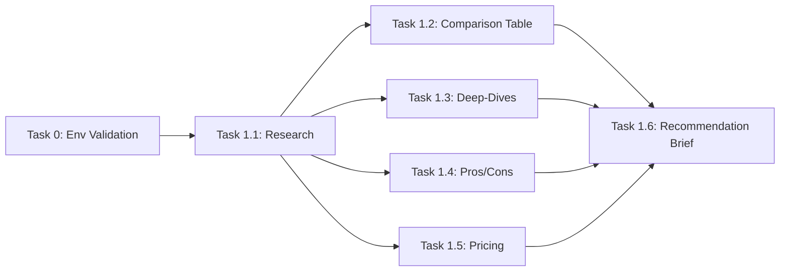

# Task Decomposition Plan

## Project Overview
**Goal:** Deliver a decision-ready recommendation brief comparing Pinecone, Weaviate, and Qdrant for scalable AI applications, including a clear recommendation, rationale, and implementation outline for a mid-size engineering team.
**Complexity:** Complex
**Total Tasks:** 7 tasks (including task-0)
**Estimated Duration:** 3–4 hours (including research, synthesis, and QC)
**Estimated Tool Calls:** 140

<reasoning>
## Requirements Analysis
- **Core requirement:** Deliver a comprehensive, actionable recommendation brief comparing Pinecone, Weaviate, and Qdrant for scalable AI applications, tailored to a mid-size engineering team.
- **Explicit requirements:**
  1. Compare the three vector DBs across key criteria (scalability, performance, integration, pricing, etc.).
  2. Analyze strengths, weaknesses, pricing, and integration complexity for each.
  3. Provide a clear, justified recommendation.
  4. Outline a high-level implementation plan for the recommended technology.
  5. Summarize findings in a concise, decision-ready brief.
- **Implicit requirements:**
  - Research and synthesize up-to-date, public information (2024).
  - Structure deliverables for quick decision-making (tables, bullet lists, summaries).
  - Ensure all findings are actionable and tailored to a mid-size team.
- **Constraints:**
  - Focus only on Pinecone, Weaviate, Qdrant.
  - Use cases: semantic search, RAG, recommendations.
  - Consider both managed and self-hosted options.
  - Pricing must be based on public info.
  - Brief must be concise (2–4 pages).
- **Success definition:** A well-structured brief with comparison table, deep-dives, pros/cons, pricing, recommendation, and implementation outline, all tailored to a mid-size engineering team.

## Complexity Assessment
- **Scope:** Large (6 main deliverables, each requiring research, synthesis, and formatting)
- **Technical complexity:** Medium–High (requires up-to-date research, synthesis, and practical recommendations)
- **Dependencies:** Web research, synthesis, structured writing, and QC
- **Estimated total tasks:** 7 (including task-0)
- **Estimated total duration:** 3–4 hours

## Repository Context
- **Existing tools:** Web search, file writing, markdown formatting, terminal commands for file management
- **Dependencies:** None (greenfield, no codebase context)
- **Configuration:** N/A
- **Patterns:** Deliverables are structured as markdown documents and tables

## Decomposition Strategy
- **Phase 0:** Environment validation (task-0)
- **Phase 1:** Research and data gathering (task-1.1)
- **Phase 2:** Synthesis and deliverable creation (tasks 1.2–1.6)
- **Phase 3:** Final brief assembly and QC (task-1.7)
- **Atomic task criteria:** Each task is focused, requires 10–50 tool calls, and is independently verifiable.

## Task Breakdown
1. **task-0:** Environment validation
2. **task-1.1:** Research and gather up-to-date data on Pinecone, Weaviate, and Qdrant
3. **task-1.2:** Create the vector database comparison table
4. **task-1.3:** Write technology deep-dive summaries
5. **task-1.4:** List pros, cons, and integration considerations
6. **task-1.5:** Summarize pricing analysis
7. **task-1.6:** Draft the recommendation brief and implementation outline
</reasoning>

---

## Task Graph

**Task ID:** task-0

**Title:** Environment Validation

**Agent Role Description:** DevOps engineer with system validation and dependency checking expertise

**Recommended Model:** gpt-4.1

**Prompt:**
🚨 **EXECUTE ENVIRONMENT VALIDATION NOW**

Verify all required dependencies and tools are available before proceeding.

**CRITICAL:** Use actual commands, not descriptions. Execute each validation and report results.

**Required Validations:**

1. **Tool Availability:**
   - Execute: `run_terminal_cmd('which curl')`
   - Execute: `run_terminal_cmd('which grep')`
   - Expected: Paths to executables

2. **Filesystem:**
   - Execute: `list_dir('.')`
   - Expected: Directory listing

3. **Write Permissions:**
   - Execute: `write` a test file and delete it
   - Expected: File can be created and deleted

4. **Network Access:**
   - Execute: `run_terminal_cmd('curl https://www.google.com')`
   - Expected: HTTP 200 response

**Success Criteria:**
- [ ] All commands executed (not described)
- [ ] All validations passed or failures documented
- [ ] Environment confirmed ready or blockers identified

**Dependencies:** None

**Estimated Duration:** 5 minutes

**Estimated Tool Calls:** 8

**Parallel Group:** N/A

**QC Agent Role Description:** Infrastructure validator who verifies actual command execution and dependency availability

**Verification Criteria:**
- [ ] (40 pts) All validation commands executed: verify tool call count > 5
- [ ] (30 pts) Filesystem and write permissions checked
- [ ] (30 pts) Network access confirmed

**Max Retries:** 2

---

**Task ID:** task-1.1

**Title:** Research and Gather Data on Pinecone, Weaviate, and Qdrant

**Agent Role Description:** AI researcher with expertise in vector databases, web research, and technical synthesis

**Recommended Model:** gpt-4.1

**Prompt:**
Execute ALL 3 research actions in order:
[ ] 1. Gather up-to-date (2024) information on Pinecone, Weaviate, and Qdrant from official docs, product pages, and reputable tech reviews.
[ ] 2. Extract key data for each: scalability, performance, integration, ecosystem, pricing, operational complexity, deployment options, security/compliance.
[ ] 3. Store findings in structured markdown notes for downstream tasks.

CRITICAL: All 3 must be completed or task fails.

**Context:**
- Focus on use cases: semantic search, RAG, recommendations.
- Target: mid-size engineering team, standard cloud/DevOps skills.
- Use only public, reputable sources.

**Tool-Based Execution:**
- Use: web_search, fetch, read_file, write
- Execute: web_search for each technology, fetch official docs, extract and summarize key data
- Store: Structured markdown notes for each technology
- Do NOT: Copy unverified or outdated info

**Success Criteria:**
- [ ] Structured notes for Pinecone, Weaviate, Qdrant with all required data fields
- [ ] Sources cited for each data point
- [ ] Data is current (2024) and relevant to scalable AI use cases

**Dependencies:** task-0

**Estimated Duration:** 30 minutes

**Estimated Tool Calls:** 30

**Parallel Group:** 1

**QC Agent Role Description:** Technical research auditor who verifies data accuracy, recency, and source credibility

**Verification Criteria:**
- [ ] (40 pts) All required data fields present for each technology
- [ ] (30 pts) Sources cited and verifiable
- [ ] (30 pts) Data is current and relevant

**Max Retries:** 3

---

**Task ID:** task-1.2

**Title:** Create Vector Database Comparison Table

**Agent Role Description:** Data analyst with expertise in technical comparison tables and markdown formatting

**Recommended Model:** gpt-4.1

**Prompt:**
Using the structured research notes, create a markdown table comparing Pinecone, Weaviate, and Qdrant across: scalability, performance, integration, ecosystem, pricing, operational complexity, deployment options, and security/compliance.

**Context:**
- Use only data from task-1.1
- Table must be clear, concise, and decision-focused

**Tool-Based Execution:**
- Use: read_file, write
- Execute: Read research notes, synthesize into a markdown table, save as `vector-db-comparison.md`
- Store: Table in markdown file
- Do NOT: Add new research or opinions

**Success Criteria:**
- [ ] Table includes all required criteria and all three technologies
- [ ] Data is accurate and matches research notes
- [ ] Table is formatted for easy comparison

**Dependencies:** task-1.1

**Estimated Duration:** 20 minutes

**Estimated Tool Calls:** 15

**Parallel Group:** 2

**QC Agent Role Description:** Technical documentation specialist who verifies table completeness, accuracy, and formatting

**Verification Criteria:**
- [ ] (40 pts) All criteria and technologies present
- [ ] (30 pts) Data matches research notes
- [ ] (30 pts) Table is well-formatted

**Max Retries:** 3

---

**Task ID:** task-1.3

**Title:** Write Technology Deep-Dive Summaries

**Agent Role Description:** Technical writer with expertise in AI infrastructure and concise technical synthesis

**Recommended Model:** gpt-4.1

**Prompt:**
For each technology, write a 1–2 paragraph summary covering: overview, strengths, weaknesses, unique features, and typical use cases. Use only data from research notes.

**Context:**
- Use research notes from task-1.1
- Summaries must be concise, accurate, and decision-focused

**Tool-Based Execution:**
- Use: read_file, write
- Execute: Read research notes, synthesize summaries, save as `vector-db-deepdives.md`
- Store: Summaries in markdown file
- Do NOT: Add new research or opinions

**Success Criteria:**
- [ ] Each technology has a 1–2 paragraph summary
- [ ] Summaries cover all required aspects
- [ ] Content is concise and accurate

**Dependencies:** task-1.1

**Estimated Duration:** 20 minutes

**Estimated Tool Calls:** 15

**Parallel Group:** 2

**QC Agent Role Description:** AI infrastructure editor who verifies summary completeness, clarity, and factual accuracy

**Verification Criteria:**
- [ ] (40 pts) All required aspects covered for each technology
- [ ] (30 pts) Summaries are concise and clear
- [ ] (30 pts) No factual errors

**Max Retries:** 3

---

**Task ID:** task-1.4

**Title:** List Pros, Cons, and Integration Considerations

**Agent Role Description:** Solution architect with expertise in AI system integration and trade-off analysis

**Recommended Model:** gpt-4.1

**Prompt:**
For each technology, create a bullet list of explicit pros, cons, and integration considerations (SDKs, APIs, deployment, language support). Use only data from research notes.

**Context:**
- Use research notes from task-1.1
- Lists must be practical and actionable

**Tool-Based Execution:**
- Use: read_file, write
- Execute: Read research notes, synthesize bullet lists, save as `vector-db-pros-cons.md`
- Store: Lists in markdown file
- Do NOT: Add new research or opinions

**Success Criteria:**
- [ ] Each technology has pros, cons, and integration notes
- [ ] Lists are explicit and actionable
- [ ] Content matches research notes

**Dependencies:** task-1.1

**Estimated Duration:** 15 minutes

**Estimated Tool Calls:** 10

**Parallel Group:** 2

**QC Agent Role Description:** Integration specialist who verifies list completeness, practicality, and accuracy

**Verification Criteria:**
- [ ] (40 pts) All required lists present for each technology
- [ ] (30 pts) Lists are actionable and accurate
- [ ] (30 pts) No missing or extraneous items

**Max Retries:** 3

---

**Task ID:** task-1.5

**Title:** Summarize Pricing Analysis

**Agent Role Description:** Cloud economics analyst with expertise in SaaS pricing and TCO modeling

**Recommended Model:** gpt-4.1

**Prompt:**
Summarize pricing models and cost estimates for Pinecone, Weaviate, and Qdrant in a markdown table or bullet summary. Include licensing notes and cost implications for a mid-size team.

**Context:**
- Use research notes from task-1.1
- Focus on public pricing info (2024) and typical workloads

**Tool-Based Execution:**
- Use: read_file, write
- Execute: Read research notes, synthesize pricing summary, save as `vector-db-pricing.md`
- Store: Pricing summary in markdown file
- Do NOT: Add new research or opinions

**Success Criteria:**
- [ ] Pricing models and estimates for all three technologies
- [ ] Licensing notes and cost implications included
- [ ] Data is accurate and current

**Dependencies:** task-1.1

**Estimated Duration:** 15 minutes

**Estimated Tool Calls:** 10

**Parallel Group:** 2

**QC Agent Role Description:** SaaS pricing auditor who verifies pricing accuracy, completeness, and clarity

**Verification Criteria:**
- [ ] (40 pts) Pricing for all three technologies included
- [ ] (30 pts) Licensing and cost implications clear
- [ ] (30 pts) Data is accurate and current

**Max Retries:** 3

---

**Task ID:** task-1.6

**Title:** Draft Recommendation Brief and Implementation Outline

**Agent Role Description:** AI solutions consultant with expertise in technical decision briefs and implementation planning

**Recommended Model:** gpt-4.1

**Prompt:**
Draft a 1–2 page executive summary with a clear recommendation, rationale, summary of key factors, and decision logic. Include a step-by-step implementation outline for the recommended technology. Use only data from previous deliverables.

**Context:**
- Use outputs from tasks 1.2–1.5
- Brief must be concise, decision-focused, and actionable

**Tool-Based Execution:**
- Use: read_file, write
- Execute: Read all previous deliverables, synthesize brief and implementation outline, save as `vector-db-recommendation.md`
- Store: Brief and outline in markdown file
- Do NOT: Add new research or opinions

**Success Criteria:**
- [ ] Clear, actionable recommendation with rationale
- [ ] Implementation outline is practical and tailored to a mid-size team
- [ ] Brief is concise (2–4 pages) and well-structured

**Dependencies:** task-1.2, task-1.3, task-1.4, task-1.5

**Estimated Duration:** 30 minutes

**Estimated Tool Calls:** 20

**Parallel Group:** 3

**QC Agent Role Description:** Executive summary reviewer who verifies clarity, actionability, and alignment with research

**Verification Criteria:**
- [ ] (40 pts) Recommendation is clear and justified
- [ ] (30 pts) Implementation outline is practical
- [ ] (30 pts) Brief is concise and well-structured

**Max Retries:** 3

---

## Dependency Summary

**Critical Path:** task-0 → task-1.1 → (task-1.2, task-1.3, task-1.4, task-1.5) → task-1.6

**Parallel Groups:**
- Group 1: task-1.1
- Group 2: task-1.2, task-1.3, task-1.4, task-1.5 (can run simultaneously after research)
- Group 3: task-1.6

**Mermaid Diagram:**

---

## Summary Table

| ID        | Title                                   | Dependencies                | Parallel Group | Est. Duration | Est. Tool Calls |
|-----------|-----------------------------------------|-----------------------------|----------------|---------------|-----------------|
| task-0    | Environment Validation                  | None                        | N/A            | 5 min         | 8               |
| task-1.1  | Research and Gather Data                | task-0                      | 1              | 30 min        | 30              |
| task-1.2  | Create Comparison Table                 | task-1.1                    | 2              | 20 min        | 15              |
| task-1.3  | Write Deep-Dive Summaries               | task-1.1                    | 2              | 20 min        | 15              |
| task-1.4  | List Pros, Cons, Integration Notes      | task-1.1                    | 2              | 15 min        | 10              |
| task-1.5  | Summarize Pricing Analysis              | task-1.1                    | 2              | 15 min        | 10              |
| task-1.6  | Draft Recommendation Brief & Outline    | 1.2, 1.3, 1.4, 1.5          | 3              | 30 min        | 20              |

---

**All 6 requirements decomposed. 7 tasks ready for execution.**